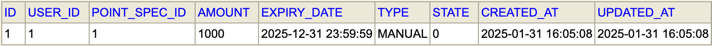
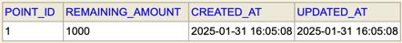
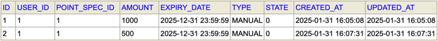
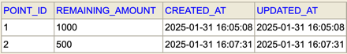
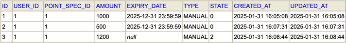
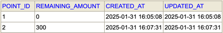
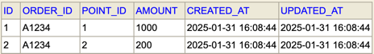
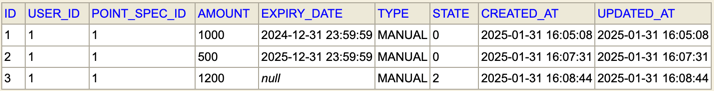
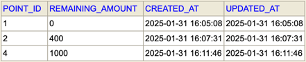
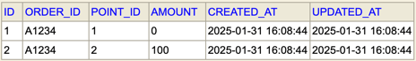

## Point System

무료 포인트 시스템을 위한 기능을 제공하는 API 서버입니다.  
포인트 적립/취소 가능을 위한 <ins>관리자 API</ins>와 포인트 사용/취소 기능을 위한 <ins>사용자 API</ins>를 제공합니다.

## Local Run
```
./gradlew clean bootRun
```
* DB console 은 `http://localhost:8080/h2-console` 을 통해 접속할수 있습니다. (로그인 정보는 `resources/application.yml` 파일 내용을 참조)

## Build
```
# jar 패키징
./gradlew clean assemble
```

## Tech Stack
* Java 21
* Spring Boot 3.1.5
* H2
* Gradle

## Package Structure
src/main/java/com.klippass
```
project
|- config        : Spring 구성
|- controller    : API 
|  |- admin      : 운영자 API
|  |- user       : 사용자 API
|- entity        : Entity 등 주요 도메인 모델
|- exception     : Exceptons
|- repository    : Repository 등 영속화 컴포넌트
|- service       : Rich Service(Transaction)
```

## Model
* `user`: 계정(이용자, 관리자)
* `user_point_limit`: 계정별 포인트 제한 정보
* `point_spec`: 포인트 정책
* `point`: 포인트 내역(적립, 적립취소, 사용, 사용취소)
* `point_balance`: 포인트별 잔액
* `point_usage`: 포인트별 사용내역

## APIs
* [post] `/api/admin/points/save` : 포인트 적립
* [post] `/api/admin/points/cancel` : 포인트 적립 취소
* [post] `/api/admin/points/update` : 포인트 적립 내용 수정
* [post] `/api/user/points/use` : 포인트 사용
* [post] `/api/user/points/cancel` : 포인트 사용 취소

## Test
```
# 모든 테스트
./gradlew clean test
# 단위 테스트
./gradlew clean unitTest
# 통합 테스트
./gradlew clean integrationTest
```

## Database Changes by Scenario

### 테스트 시나리오
1. 1000원 적립한다.
2. 500원 적립한다.
3. 주문번호 A1234 에서 1200원 사용한다.
4. A의 적립이 만료되었다.
5. C의 사용금액 1200원 중 1100원을 부분 사용취소 한다.

### 테스트
#### 1. 1000원 적립한다.
실행
```shell
curl -X POST localhost:8080/api/admin/points/save \
  -H "Accept: application/json" \
  -H "Content-Type: application/json" \
  -d '{"userId":1,"amount":1000,"expiryDate":"2025-12-31T23:59:59"}'
```
실행 후,  
* `point` 테이블: 1000원이 적립되었습니다.  

* `point_balance` 테이블: 총 잔액은 1000원으로 변경됩니다.  


#### 2. 500원 적립한다.
실행
```shell
curl -X POST localhost:8080/api/admin/points/save \
-H "Accept: application/json" \
-H "Content-Type: application/json" \
-d '{"userId":1,"amount":500,"expiryDate":"2025-12-31T23:59:59"}'
```
실행 후, 
* `point` 테이블: 500원이 적립되었습니다.  

* `point_balance` : 총 잔액은 1500원(=1000+500)으로 변경됩니다.  


#### 3. 주문번호 A1234 에서 1200원 사용한다.
실행
```shell
curl -X POST localhost:8080/api/user/points/use \
  -H "Accept: application/json" \
  -H "Content-Type: application/json" \
  -d '{"userId":1,"amount":1200,"orderId":"A1234"}'
```  
실행 후, 
* `point` 테이블: 1200원이 사용되었습니다.  

* `point_balance` 테이블: 총 잔액은 300원(=0+300)으로 변경됩니다.  
 
* `point_usage` 테이블: 포인트1(1000원)와 포인트2(200원)가 사용되었습니다.   


#### 4. A의 적립이 만료되었다.
```shell
curl -X POST localhost:8080/api/admin/points/update \
  -H "Accept: application/json" \
  -H "Content-Type: application/json" \
  -d '{"pointId":1,"expiryDate":"2024-12-31T23:59:59"}'
```
실행 후,
* `point` 테이블: 포인트1의 만료일이 지났습니다. (=관리자 API를 사용해서 지난 날짜로 변경)  


#### 5. C의 사용금액 1200원 중 1100원을 부분 사용취소 한다.
실행
```shell
curl -X POST localhost:8080/api/user/points/cancel \
  -H "Accept: application/json" \
  -H "Content-Type: application/json" \
  -d '{"userId":1,"amount":1100,"orderId":"A1234"}'
```
실행 후, 
* `point` 테이블: 1100원이 취소되며, 사용되었던 (만료된) 포인트1의 수량은 새로 추가되고, (만료되지 않은) 포인트2의 수량은 환불 수량만큼 변경됩니다.  

* `point_balance` 테이블: 총 잔액은 1400원(=400+1000)으로 변경됩니다.  

* `point_usage` 테이블: 포인트1(0원)와 포인트2(100원)가 사용으로 변경됩니다.  
